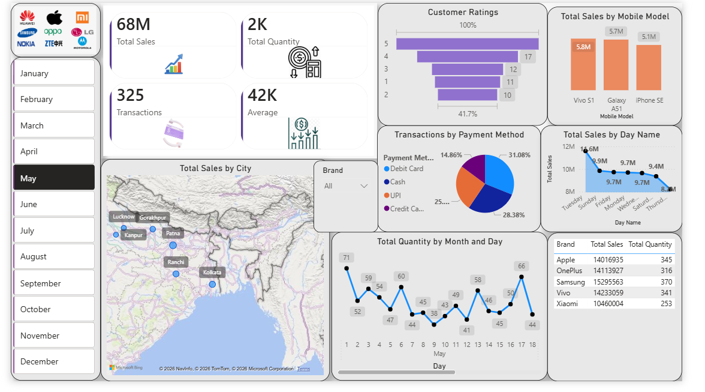

# 📱Mobiles-Sales-Dashboard
📌 Project Overview

This project is an interactive Mobile Sales Dashboard developed using Microsoft Power BI. The dashboard provides insights into mobile phone sales performance, customer ratings, transaction trends, payment methods, brand-wise sales, and geographical distribution of sales.

The dashboard helps business users analyze sales data and make data-driven decisions through interactive visualizations and KPIs.

---

- 🎯 Objectives
  
•Analyze total mobile sales and quantity sold. 
•Track transaction performance. 
•Compare sales across different mobile brands. 
•Monitor customer ratings. 
•Identify popular payment methods. 
•Analyze sales trends by month and day. 
•Visualize sales distribution across cities. 

---

🛠 Tools & Technologies Used

•Microsoft Power BI 
•Power Query Editor 
•DAX (Data Analysis Expressions) 
•Data Modeling 
•Interactive Visualizations 

---

- 📊 Dashboard Features
  
•KPI Cards 
•Total Sales 
•Total Quantity Sold 
•Total Transactions 
•Average Sales Value 
•Visualizations 
•Customer Ratings Analysis 
•Total Sales by Mobile Model 
•Transactions by Payment Method (Pie Chart) 
•Total Sales by Day Name (Line Chart) 
•Total Sales by City (Map Visual) 
•Total Quantity by Month and Day 
•Brand-wise Sales and Quantity Table 
•Interactive Filters 
•Brand Filter 
•Month Filter 
•Mobile Brand Logo Selection 

<h2>Total Transactions</h2>
 
Transactions = COUNTROWS(Sales_Data)
<h2>Total Sales</h2>
 
Total Sales = SUMX(Sales_Data,Sales_Data[Units Sold]*Sales_Data[Price Per Unit])

- 🔄 Data Transformation Using Power Query 

The following transformations were performed: 
•Data Cleaning 
•Removed duplicate records 
•Handled missing/null values 
•Corrected data types 
•Renamed columns for readability 
•Date Transformations 
•Extracted Month Name 
•Extracted Day Name 
•Created Date Hierarchy 
•Data Preparation 
•Standardized brand names 
•Formatted sales values 
•Created calculated columns for analysis 
•Data Modeling 
•Established relationships between tables 
•Optimized data model for performance 

---

🎨 Dashboard Design & Styling 
•Theme 
•Clean and modern business dashboard 
•Light background with purple accents 
•Rounded corners for visual appeal 
•Design Elements 
•Custom KPI Cards 
•Mobile Brand Logos 
•Interactive Slicers 
•Consistent Typography 
•Professional Layout Structure 
•User Experience 
•Easy navigation 
•Interactive filtering 
•Responsive visual arrangement 
•Business-focused KPIs 

---

## Dashboard Preview 

